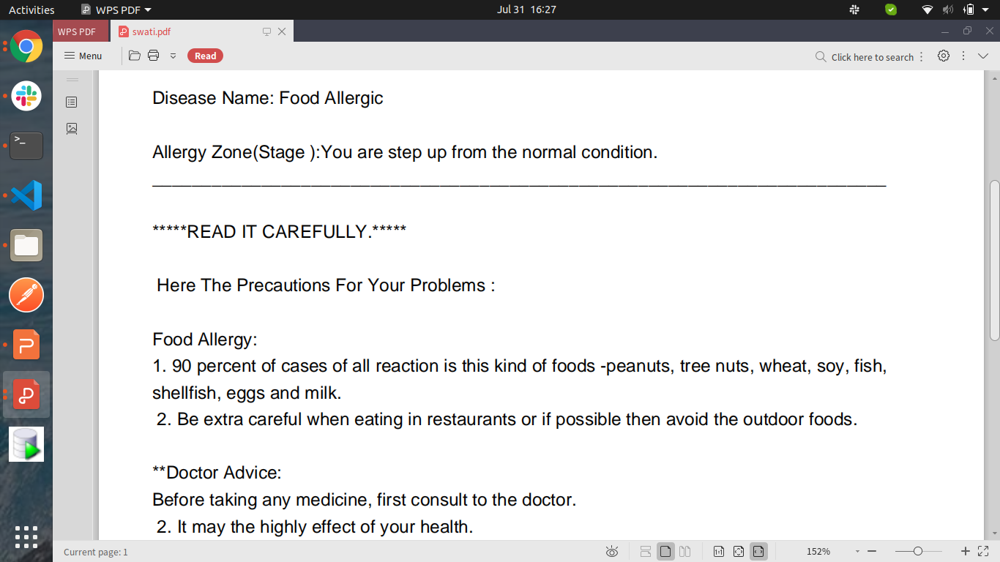

# :hospital: HealthCare Management System

* Project build within a 4 days.
* The health care management system is console based project, which helps the patient to get an appointment online.
  The Main role in this project is:
    * Patient:  Having the authority to login and register. It is totally upto patient, either they can goto to the hospital and get the appointment ticket Or they can answer the certain question.
    * Doctor:  Bases on the patient answer they will provide the solution of the problem and give some precautions.
    
 * Patient reports generate in the form of PDF.
 
 # Needs?
 
 * It helps the patient to without going anywhere, they get the solution, and talk to consultant.
 
 # Implementation
 
 * Java Oops Properties.
 * PDF Generator using Itext jar files.
 
 * Screenshots
 
  
  
  

